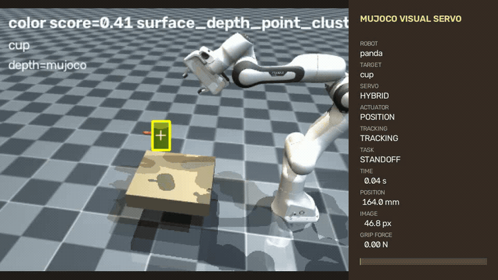
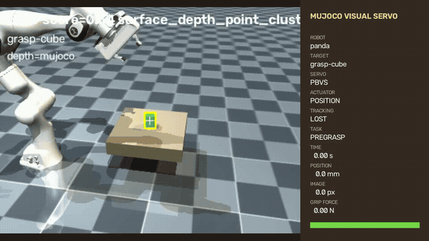
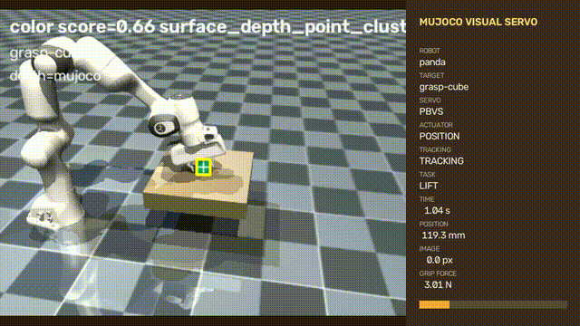
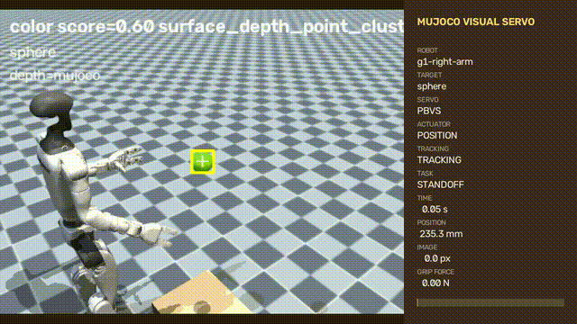

# MuJoCo Visual Servo & Grasping

一个可直接运行的 MuJoCo 视觉伺服与机械臂抓取项目。目标在动，机械臂会根据相机画面持续调整；同一套程序也可以完成接近、接触抓取、抬升和放置。



这段 15 秒录屏使用 Panda、固定 RGB-D 相机、颜色分割和 Hybrid 视觉伺服。红色杯子沿圆周移动，机械臂默认保持 `10 cm` 距离；控制器只使用视觉观测更新末端目标，没有用 oracle 代替检测。录制期间完成 360 次视觉更新，没有发生跟踪丢失，稳态 RMS 跟随误差为 `11.9 mm`。下载原始画质：[MP4](mujoco/media/visual-servo-dashboard.mp4) · [PNG](mujoco/media/visual-servo-dashboard.png)

## 项目包含什么

- `IBVS`、`PBVS` 和远近切换的 `Hybrid` 视觉伺服；
- MuJoCo RGB-D、颜色分割，以及 Grounding DINO + SAM 开放词汇识别；
- 位置、速度、力矩、阻抗四种关节控制方式；
- 可执行抓取点、双指接触验证、抬升和 pick-and-place；
- Panda、FR3、UR、xArm、Kinova、KUKA、Sawyer 和 Unitree G1 等 Menagerie 模型；
- 可自由旋转的 MuJoCo viewer，以及适合录屏的 16:9 状态面板；
- JSON 机器人/目标描述，可替换 MJCF、mesh、末端、夹爪和抓取点。

## 抓取不是位姿动画



抓取过程不会把物体 weld 到夹爪，也不会直接改写物体位姿。系统要求两个手指形成相向接触，法向力和相对滑移同时满足阈值，才会进入抬升阶段；抬升后仍继续检查接触，物体脱落会立刻把任务改为失败。

当前颜色视觉验收在 207 个控制步内完成，物体抬升 `10.6 cm`，峰值合法夹持力 `20.46 N`，最终状态为 `grasp_succeeded`。原始录屏：[MP4](mujoco/media/contact-grasp-dashboard.mp4)

## 从视觉抓取到放置



策略顺序执行目标获取、抓取点选择、预抓取、闭合、接触确认、抬升、搬运、释放和落点检查。MuJoCo 真值只参与最终评测，不作为颜色视觉控制输入。原始录屏：[MP4](mujoco/media/pick-place-dashboard.mp4)

## 安装

项目使用 Miniconda。MuJoCo Menagerie 作为 git submodule 一起下载。

```bash
git clone --recurse-submodules https://github.com/MengyangGao/visual_servo_tracking.git
cd visual_servo_tracking
conda env create -f environment.yml
conda activate visual_servo
```

已有环境可以直接更新：

```bash
conda env update -n visual_servo -f environment.yml --prune
```

## 运行

### 移动目标跟随

macOS 的 MuJoCo 相机和原生 viewer 需要从 `mjpython` 启动：

```bash
conda activate visual_servo
mjpython mujoco/scripts/demo.py \
  --robot panda --target cup --trajectory circle \
  --detector color --servo-mode hybrid
```

viewer 相机可以自由移动。方向键可给目标叠加水平速度，`,` 和 `.` 控制下降/上升，Space 或 Backspace 清除手动偏移。

Linux 无窗口运行可使用 EGL：

```bash
MUJOCO_GL=egl mujoco-servo \
  --headless --no-realtime --scripted-target \
  --robot panda --target cup --trajectory circle \
  --detector color --servo-mode hybrid --steps 1800
```

### 接触抓取

```bash
mjpython mujoco/scripts/demo.py \
  --headless --no-realtime --scripted-target \
  --robot panda --target grasp-cube --trajectory static \
  --detector color --servo-mode pbvs --task grasp --steps 1800
```

### Pick-and-place

```bash
mjpython mujoco/scripts/demo.py \
  --headless --no-realtime --scripted-target \
  --robot panda --target grasp-cube --trajectory static \
  --detector color --servo-mode pbvs --task pick-place \
  --steps 3200 --place-position 0.42 -0.16 0.25
```

加上 `--record output.mp4` 可以保存状态面板。运行 `mujoco-servo --help` 查看相机、噪声、控制器、抓取阈值和策略参数。

## 三种视觉伺服

| 模式 | 控制依据 | 用途 |
| --- | --- | --- |
| `ibvs` | 图像特征、像素误差、目标深度 | 观察经典图像雅可比闭环 |
| `pbvs` | 相机恢复的三维位置与姿态 | 大范围移动和抓取 |
| `hybrid` | 远处使用 PBVS，接近后平滑切到 IBVS | 移动目标演示的默认选择 |

视觉外环生成笛卡尔速度，关节控制器负责阻尼最小二乘、关节限位回避、速度/加速度限制和零空间姿态。检测暂时丢失时机械臂会保持，连续观测恢复后再继续跟随。

## 机器人模型



内置机器人来自锁定版本的 [MuJoCo Menagerie](https://github.com/google-deepmind/mujoco_menagerie)：

| 名称 | 自由度 | 适合的任务 |
| --- | ---: | --- |
| `panda` | 7 | 跟随、接触、双指抓取、放置 |
| `fr3` | 7 | 跟随、接触 |
| `ur5e` / `ur10e` | 6 | 跟随、接触 |
| `lite6` / `xarm7` | 6 / 7 | 跟随；xArm7 保留官方夹爪执行器 |
| `iiwa14` / `kinova-gen3` / `sawyer` | 7 | 跟随、接触 |
| `g1-left-arm` / `g1-right-arm` | 7 | 固定基座人形机器人上肢实验 |

G1 示例控制左右上肢，不包含双足平衡和行走。`G1BimanualController` 提供双臂目标组合与安全间距约束，方便继续做交接或双臂操作。

## 换成自己的物体或机械臂

目标描述支持 box、sphere、cylinder、capsule、compound 和 OBJ/STL mesh，并可配置尺寸、质量、摩擦、初始姿态及多个局部抓取点：

```bash
mujoco-servo --target-file /path/to/targets.json --target my-object
```

机器人描述引用一个自包含 MJCF，并声明受控关节、执行器、home 位姿、末端 frame，以及可选的夹爪控制与接触 body：

```bash
mujoco-servo --robot-file /path/to/robots.json --robot my-robot
```

描述符在加载时会检查路径、关节、执行器、控制范围、工作区和抓取宽度，错误配置不会静默退回 Panda 或默认方块。

## Python API

```python
from mujoco_servo.app import VisualServoSimulation
from mujoco_servo.config import ControllerConfig, DemoConfig

config = DemoConfig(
    robot="panda",
    target="cup",
    trajectory="circle",
    detector="oracle",
    headless=True,
    viewer=False,
    realtime=False,
    controller=ControllerConfig(servo_mode="hybrid"),
)

with VisualServoSimulation(config) as simulation:
    for _ in range(300):
        state = simulation.step()
    print(state.target_position, state.end_effector_position)
```

状态中可以读取目标、末端、相机、关节、检测时间、接触力、滑移、抬升高度和策略阶段。

## 验证

```bash
conda run -n visual_servo pytest -q mujoco/tests
conda run -n visual_servo ruff check mujoco
conda run -n visual_servo python -m mujoco_servo.benchmark --enforce
```

GitHub Actions 在 Python 3.10–3.13 上运行静态检查、测试、覆盖率、wheel 构建和安装后冒烟测试。机器人与素材来源见 [mujoco/ASSETS.md](mujoco/ASSETS.md)。

## 使用边界

这是仿真与学习项目，不是经过安全认证的真实机器人控制器。开放词汇识别首次运行需要下载模型；学习视觉可使用 CUDA、Apple MPS 或 CPU，MuJoCo 动力学仍在 CPU 上运行。真实机械臂还需要硬件标定、通信、急停、碰撞保护和现场安全验证。
