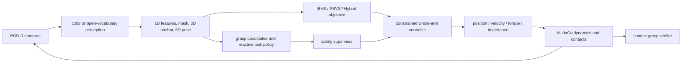

# MuJoCo Visual Servo Lab

一个面向学习、实验和作品展示的 MuJoCo 视觉伺服平台。当前开发只覆盖 `mujoco/`；`matlab/` 已冻结，不参与安装、测试或运行。


上图由本仓库真实运行生成：Panda、颜色分割、MuJoCo RGB-D、移动目标和 Hybrid IBVS/PBVS。原始文件：[MP4](mujoco/media/visual-servo-dashboard.mp4) · [PNG](mujoco/media/visual-servo-dashboard.png)

## 能做什么

- 从 MuJoCo 状态读取本体、末端、相机、目标、关节和接触信息；
- 在 `ibvs`、`pbvs` 和 `hybrid` 三种视觉闭环之间切换；
- 支持外部相机、眼在手上相机、同步 RGB-D 和独立概览相机；原生 viewer 始终保持自由移动；
- 支持颜色检测和开放词汇语义检测；语义链路使用 Grounding DINO + SAM；
- 从分割后的度量深度估计三维锚点、6D 主轴姿态和尺寸；
- 提供带标签的多目标跟踪与短时遮挡预测；
- 支持位置、速度、力矩和阻抗四种关节执行模式；
- 支持跟踪、接近、接触、抓取、抬升、完整 pick-and-place 及单轴对齐任务；
- 提供可解释抓取点评分、接触验证、放置验收、超时/滑移恢复和笛卡尔安全监督；
- 通过 JSON 替换机器人和目标，也内置多种官方 MuJoCo Menagerie 本体；
- 支持 Unitree G1 左/右臂视觉伺服和固定基座双臂协调原语；
- 输出 16:9 仪表盘、MP4/MOV/AVI、运行指标和可复用 Python API。

## 真实接触抓取


这段演示没有使用 weld、mocap 附着或位姿瞬移。成功条件要求两个不同手指同时接触目标、接触法向相反、法向力超过阈值、相对滑移受限，并连续保持若干控制帧。演示最终测得约 `2.18 N` 合法夹持力和 `0.13 mm/frame` 相对滑移，并完成约 `8.6 cm` 抬升。原始文件：[MP4](mujoco/media/contact-grasp-dashboard.mp4) · [PNG](mujoco/media/contact-grasp-dashboard.png)

## 视觉抓取与放置策略


这段 20 秒实录由颜色视觉和 MuJoCo RGB-D 驱动，策略依次完成目标获取、抓取点选择、预抓取、闭合、接触验证、抬升、搬运、放置、释放和撤离。它不读取目标真值来控制；MuJoCo 真值只用于最终验收。此次录制为 `COMPLETE`，0 次恢复，最终物体中心距落点 `12.8 mm`。原始文件：[MP4](mujoco/media/pick-place-dashboard.mp4) · [PNG](mujoco/media/pick-place-dashboard.png)

抓取规划器会拒绝超过夹爪宽度、超出工作距离或侵入桌面的候选，再按可达性、相机可见性、宽度余量和净空排序。反应式策略在接触超时、夹持不稳定或搬运滑移时松爪、上撤并重新规划；重试次数有界。安全监督还会拒绝非有限命令，限制工作空间和单次目标距离，并在法向力超限时 fail closed。

## 安装（Miniconda）

```bash
git clone --recurse-submodules <repository-url>
cd visual_servo_tracking
conda env create -f environment.yml
conda activate visual_servo
```

如果仓库已经下载但子模块为空：

```bash
git submodule update --init --recursive mujoco/vendor/mujoco_menagerie
```

如果环境已经存在：

```bash
conda env update -n visual_servo -f environment.yml --prune
conda activate visual_servo
```

环境固定 Python 3.11，并以 editable 模式安装颜色视觉、语义视觉、测试和开发依赖。学习模型首次使用时会从 Hugging Face 下载权重。

## 五分钟上手

以下命令均在仓库根目录执行。

外部相机 Hybrid 视觉跟踪：

```bash
conda run -n visual_servo mujoco-servo \
  --robot panda --target cup --trajectory circle \
  --detector color --servo-mode hybrid
```

纯 IBVS：

```bash
conda run -n visual_servo mujoco-servo \
  --robot panda --target cup --trajectory circle \
  --detector color --servo-mode ibvs
```

眼在手上 IBVS：

```bash
conda run -n visual_servo mujoco-servo \
  --robot panda --target cup --trajectory static \
  --detector color --servo-mode ibvs \
  --camera-role eye-in-hand --camera-mount-body hand
```

开放词汇语义检测与分割：

```bash
MUJOCO_SERVO_DEVICE=auto conda run -n visual_servo mujoco-servo \
  --robot panda --target cup --prompt "red drinking mug" \
  --detector semantic --servo-mode hybrid
```

无 weld 的视觉抓取：

```bash
conda run -n visual_servo mujoco-servo \
  --headless --no-realtime --scripted-target \
  --robot panda --target grasp-cube --trajectory static \
  --detector color --servo-mode pbvs --task grasp \
  --steps 300 --camera-fps 12 \
  --record mujoco/media/my-grasp.mp4
```

颜色视觉 pick-and-place：

```bash
conda run -n visual_servo mujoco-servo \
  --headless --no-realtime --scripted-target \
  --robot panda --target grasp-cube --trajectory static \
  --detector color --servo-mode pbvs --task pick-place \
  --steps 2400 --camera-fps 24 \
  --record mujoco/media/my-pick-place.mp4
```

用 `--place-position X Y Z` 指定物体中心落点；也可配置 `--policy-max-attempts`、阶段超时和最大接触力。省略落点时会选择桌面内部带安全裕量的位置。

macOS 的交互 viewer 必须由 MuJoCo 的 `mjpython` 启动：

```bash
conda activate visual_servo
mjpython mujoco/scripts/demo.py --robot panda --target cup --trajectory circle
```

方向键移动目标，`,` / `.` 控制下降/上升，Space 或 Backspace 清除手动偏移。viewer 使用自由相机；相机画面和检测结果显示在叠加层中。

## 视觉伺服模式

| 模式 | 闭环量 | 适合场景 |
| --- | --- | --- |
| `ibvs` | 归一化图像特征、像素误差和目标深度；使用点特征交互矩阵 | 展示经典视觉伺服、对标定误差更鲁棒的近距离控制 |
| `pbvs` | 世界坐标中的三维目标/抓取位姿误差 | 大范围移动、抓取规划、可解释的米制误差 |
| `hybrid` | 远距离 PBVS，接近目标后连续过渡到 IBVS | 默认展示和移动目标跟踪 |

图像外环产生世界坐标笛卡尔速度。关节层使用加权阻尼最小二乘、关节限位回避、速度/加速度限制、零空间姿态控制和感知丢失保持。`position`、`velocity`、`torque`、`impedance` 只改变低层执行方式，不改变视觉目标定义。



## Menagerie 本体


这段 G1 右臂实录同样使用颜色视觉而非 oracle：目标持续处于 `TRACKING`，无丢失/重捕获事件，最终 16 cm standoff 误差为 `7.7 mm`。原始文件：[MP4](mujoco/media/g1-visual-servo-dashboard.mp4) · [PNG](mujoco/media/g1-visual-servo-dashboard.png)

| CLI 名称 | 受控自由度 | 说明 |
| --- | ---: | --- |
| `panda` | 7 | 官方双指夹爪；真实接触抓取基准 |
| `fr3` | 7 | Franka FR3 |
| `ur5e` | 6 | Universal Robots UR5e 工具端 |
| `ur10e` | 6 | Universal Robots UR10e 工具端 |
| `lite6` | 6 | UFactory Lite6 |
| `xarm7` | 7 | UFactory xArm7，保留官方夹爪执行器 |
| `iiwa14` | 7 | KUKA iiwa 14 |
| `kinova-gen3` | 7 | Kinova Gen3 |
| `sawyer` | 7 | Rethink Sawyer |
| `g1-right-arm` | 7 | Unitree G1 固定基座右臂学习示例 |
| `g1-left-arm` | 7 | Unitree G1 固定基座左臂学习示例 |

所有条目都从锁定版本的 `mujoco/vendor/mujoco_menagerie` 加载。G1 左右臂可分别运行完整视觉外环；`G1BimanualController` 可把同一视觉目标转换为左右手安全间距目标，并组合两个互不覆盖的 7-DoF 控制器。G1 示例固定浮动基座，只用于上肢视觉伺服/交接学习，不声称实现双足平衡或行走。没有夹爪的工具端模型可以完成跟踪、接近和接触；真实夹持需要描述符声明实际夹爪执行器与两侧接触体。

## 相机、6D 姿态和多目标

每个场景至少包含：

- `servo_camera`：视觉闭环主相机，可固定在世界或挂载到机器人 body；
- `servo_overview`：独立观察相机；
- 原生 viewer 的自由相机：只影响人类观察，不改变控制输入。

`mujoco_servo.vision.CameraRig` 可同步读取任意命名相机的 RGB-D。`estimate_pose_6d()` 从分割掩码与度量深度构建点云，再给出中心、正交主轴、三维尺寸与质量分数。`MultiTargetTracker` 用类别标签和三维最近邻保持多目标 ID，并在有界时间内进行速度预测；超时后删除轨迹而不是无限使用旧观测。

## 替换目标和机器人

目标 JSON 支持 primitive、compound 或 OBJ/STL mesh，包含质量、摩擦、初始四元数和多个局部抓取点。使用：

```bash
mujoco-servo --target-file /path/to/targets.json --target my-object
```

机器人 JSON 声明自包含 MJCF、assets、受控关节/执行器、home 位姿、末端 frame，以及可选的夹爪执行器、开合控制和双侧接触 body。使用：

```bash
mujoco-servo --robot-file /path/to/robots.json --robot my-robot
```

内置描述符和严格 JSON 解析实现位于 `mujoco/src/mujoco_servo/config.py`。运行 `mujoco-servo --help` 查看完整参数。

## Python API

```python
from mujoco_servo.app import VisualServoSimulation
from mujoco_servo.config import ControllerConfig, DemoConfig

config = DemoConfig(
    robot="panda",
    target="cup",
    detector="color",
    controller=ControllerConfig(servo_mode="hybrid", actuator_mode="impedance"),
    headless=True,
    viewer=False,
    realtime=False,
)

with VisualServoSimulation(config) as simulation:
    for _ in range(300):
        state = simulation.step()
    print(state.as_dict())
```

公共状态包括目标/末端/相机/关节位置、检测时间和协方差、跟踪状态、接触、抓取力、相对滑移和抬升高度。

`pick-place` 的 `RunSummary` 还包含策略名称、尝试次数、选中抓取点、落点、放置误差、任务成功标志和失败原因。策略、抓取规划器与安全监督位于 `mujoco_servo.policy`，可脱离 viewer 单独测试或替换。

## 验证

```bash
conda run -n visual_servo python -m pytest -q mujoco/tests
conda run -n visual_servo ruff check mujoco/src mujoco/tests
conda run -n visual_servo python -m mujoco_servo.benchmark \
  --robots panda fr3 ur5e xarm7 g1-left-arm g1-right-arm \
  --actuator-modes position velocity torque impedance \
  --trajectories static circle --steps 240
```

测试覆盖配置校验、三种视觉外环、相机几何、颜色/语义后端、深度、6D 姿态、多目标遮挡、所有内置 Menagerie 场景、四种执行模式、抓取候选排序、安全监督、接触抓取、pick-and-place 和 G1 双臂命令组合。

## 明确边界

- 这是高保真仿真平台，不是已验证的真实机器人安全控制器；没有 ROS 2、急停、硬件标定和实机碰撞认证。
- 开放词汇语义与单目深度依赖外部模型，首次运行需要网络和较多内存；自动设备顺序为 CUDA、Apple MPS、CPU。
- 基于点云 PCA 的 6D 姿态对对称物体存在不可消除的轴向歧义。
- 真实接触抓取依赖模型几何、摩擦和夹爪；不再用 weld 掩盖失败，因此任意新物体/本体都需要重新验证。
- 当前策略是反应式笛卡尔状态机和局部抓取点规划，不是带障碍物地图的全局运动规划器；复杂杂乱场景仍需接入 OMPL/采样规划或学习策略。
- G1 只验证固定基座上肢，不包含行走、质心/足底约束或跌倒恢复。
- MuJoCo 动力学运行在 CPU；学习视觉可使用 CUDA/MPS，渲染使用平台 OpenGL 后端。

模型许可和来源见 [mujoco/ASSETS.md](mujoco/ASSETS.md)。
